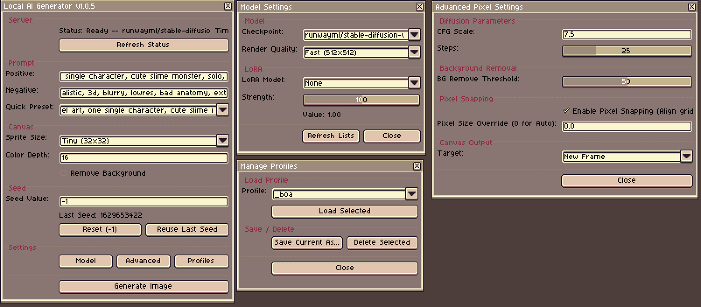
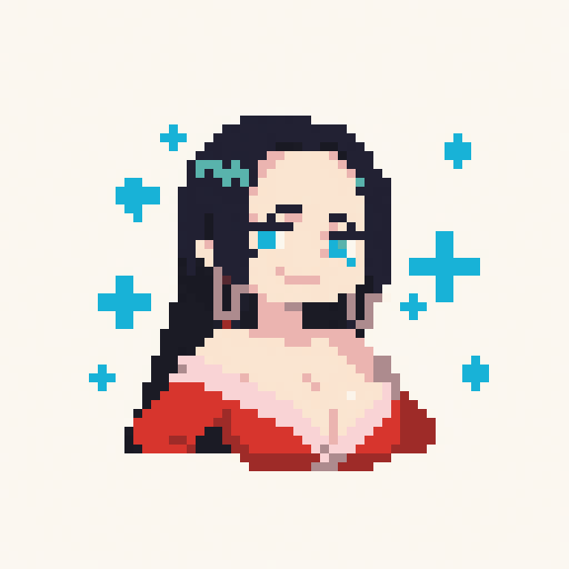

# Aseprite AI Generator (AAG)

**Aseprite AI Generator (AAG)** is a bridge that connects local Generative AI (Stable Diffusion) directly with the Aseprite pixel art editor. It converts your text prompts into ready-to-use game sprites within seconds, running 100% locally on your machine's GPU.



---

## Key Highlights

* **Local & Private:** All processing is done locally. No images are sent to the cloud, keeping your project assets private and secure.
* **Professional Pixel Quantization:** Uses high-quality Color Quantization (Median Cut) and Nearest Neighbor scaling to turn AI images into clean, sharp pixel art with customizable palette color counts.
* **AI Background Removal:** Powered by **BiRefNet**, a high-end background segmentation model that automatically isolates sprites and outputs transparency-ready PNGs.
* **LoRA Support:** Integrates LoRA models to direct artistic styles (e.g., 8-bit, 16-bit, Isometric, or specific artist styles) on top of your base models.
* **Optimized for SDXL & SD 1.5:** Supports high-quality Stable Diffusion XL models as well as lightweight Stable Diffusion 1.5 models for fast iteration.
* **Next-Gen GPU Acceleration:** Optimized for NVIDIA RTX GPUs (including Blackwell/RTX 50 Series architecture) with custom configurations for bfloat16 precision, cuDNN benchmarks, and VRAM memory offloading.

---

## Generation Examples

Here are some examples of what you can generate using AAG, along with the prompts and settings used.

| Output Image | Prompt & Settings |
| :---: | :--- |
|  | **Prompt:** `score_9, score_8_up, score_7_up, score_6_up, white background, 1girl, solo, portrait, looking at viewer, BREAK, Boa Hancock, large breasts, cleavage, off-shoulder dress, collarbone, long black hair, blue eyes, smug smile, gold earrings, one piece style` <br> **Negative Prompt:** `score_6, score_5, score_4, score_3, score_2, score_1, realistic, 3d, photorealistic, blurry, lowres, bad anatomy, bad hands, extra fingers, extra arms, extra legs, malformed limbs, deformed face, mutated hands, text, watermark, signature, duplicate, cropped, worst quality` <br> **Model:** [ponyDiffusionV6XL_v6StartWithThisOne.safetensors](https://civitai.com/models/257749/pony-diffusion-v6-xl) <br> **LoRA:** [Pony_shirosu0011.safetensors](https://civitai.com/models/493151/pixel-art-shirosu-artist-style-pony) (Strength: `1.0`) <br> **Settings:** Size: `64x64` \| Steps: `30` \| CFG: `7` \| Colors: `64` |
|  | **Prompt:** `score_9, score_8_up, score_7_up, score_6_up, white background, 1girl, solo, portrait, looking at viewer, BREAK, Boa Hancock, large breasts, cleavage, off-shoulder dress, collarbone, long black hair, blue eyes, smug smile, gold earrings, one piece style` <br> **Negative Prompt:** `score_6, score_5, score_4, score_3, score_2, score_1, realistic, 3d, photorealistic, blurry, lowres, bad anatomy, bad hands, extra fingers, extra arms, extra legs, malformed limbs, deformed face, mutated hands, text, watermark, signature, duplicate, cropped, worst quality` <br> **Model:** [hyphoria_v002_2.safetensors](https://civitai.com/models/1595884/hyphoria) <br> **LoRA:** [[Ilu] Pixel_Resin_x16_contrast_ep20.safetensors](https://civitai.com/models/1999880/pixelresin-x16-pixel-art) (Strength: `1.0`) <br> **Settings:** Size: `64x64` \| Steps: `30` \| CFG: `7` \| Colors: `32` |

---

## Repository Structure

The project features a clean, modular design separating the backend server from the Aseprite frontend extension:

### 1. Python Backend Server (Repository Root)
```text
├── sd_server.py              # Main entry point (calls src/api_server.py)
├── startup_script.py         # Handles dependency installs & setup configuration
├── Start Server.bat          # Batch script to auto-initialize and run the local API server
├── Pack Extension.bat        # Packages active Lua extension source files from AppData
├── requirements.txt          # Python dependencies list
├── PixelAI.aseprite-extension # The packed installer file for Aseprite
├── src/                      # Backend Source Code
│   ├── api_server.py         # Flask REST API endpoints and router logic
│   ├── models_manager.py     # Model loading, CPU memory caching, and GPU memory offload
│   └── image_processing.py   # Background removal & pixel art quantization
├── models/                   # Local Stable Diffusion checkpoint directory (.safetensors / .ckpt)
├── loras/                    # Local LoRA weights folder for custom pixel art styles
├── docs/                     # Documentation files (Thai language)
└── sample/                   # Assets for documentation and examples
```

### 2. Aseprite Extension (Lua Source)
```text
├── package.json              # Aseprite extension metadata manifest
├── main.lua                  # Extension menu registration command
├── local-ui-main.lua         # Main dialog UI layout and canvas cel rendering
└── libs/                     # Shared Lua helper libraries
    ├── subdialogs.lua        # Settings panels (Models, Advanced, Profiles)
    ├── http-client.lua       # Communicates with Flask server
    ├── api-service.lua       # API request wrapper and payload handler
    ├── settings-store.lua    # Load and save profile settings presets
    ├── json.lua              # JSON encoder/decoder
    └── base64.lua            # Decodes base64 generated images from server
```

---

## Prerequisites

Before setting up the project, please ensure your system meets the following specifications:
* **OS:** Windows 10 or 11
* **Python:** 3.10.x - 3.12.x (Recommended)
* **GPU:** NVIDIA GPU with 8GB+ VRAM (e.g., RTX 30/40/50 Series with CUDA support)
* **Storage:** 10GB+ of free space
* **Aseprite:** v1.2.10 or newer

---

## Getting Started

### 1. Initialize Python Backend
1. Clone this repository to your local drive.
2. Double-click `Start Server.bat` inside the folder. The script will:
   * Create a Python virtual environment (`venv/`) if it does not exist.
   * Auto-install `PyTorch` (CUDA-supported), `diffusers`, `transformers`, `Flask`, and all image-processing dependencies.
   * Ask you to select your default model (SDXL or SD 1.5) and prompt you to run in Online Mode on the first startup to download the models.
3. Once downloaded and loaded, you will see a text confirmation: **Server ready!** Keep this window open during your Aseprite sessions.

### 2. Install Aseprite Extension

1. Simply double-click the **`PixelAI.aseprite-extension`** file located in the root of this repository.
2. Aseprite will launch and prompt you to install the extension automatically. Click **Install**.
3. Restart Aseprite to complete the setup.

Once installed, you can launch the plugin via **File > Local AI Generator**. Simply enter your prompt and click **Generate** to create pixel art directly on your canvas!

---

## Adding Custom Models & LoRAs

You can easily expand AAG by adding custom models (Checkpoints) and style adapters (LoRAs) downloaded from platforms like Hugging Face or [Civitai](https://civitai.com/).

### 1. Adding Custom Checkpoints
Place your Stable Diffusion base models (e.g., SD 1.5, SDXL, or Pony/Illustrious-based checkpoints) inside the `models/` directory:
```text
models/
```
* **Auto Detection:** The server automatically detects whether a local model is SDXL or SD 1.5 using:
  1. File size (files > 5.0 GB are treated as SDXL).
  2. Embedded safetensors metadata (architecture / base model version).
  3. Filename keywords (`sdxl`, `pony`, `illustrious`, `xl`, `hyphoria`, `noob`, `walnut`, `plantmilk`).
  *Therefore, renaming your model files is no longer strictly required, but adding keywords like `_xl` is still recommended for organizational clarity.*
* **Startup Selection:** After placing files in the `models/` folder, run `startup_script.py` (or double-click `Start Server.bat`). The script will automatically detect your local models and display them as options in the CLI menu.

### 2. Adding Custom LoRAs
Place your style LoRA adapters inside the `loras/` directory:
```text
loras/
```
* **Auto Detection:** Similar to checkpoints, LoRAs are auto-detected via embedded metadata, file size, or filename keywords (`sdxl`, `pony`, `illustrious`, `shirosu`, `ilu`, `noob`, `xl`).
* **Aseprite Integration:** Once files are placed, restart the Python server. The backend API will automatically scan this folder and make your custom LoRAs available in the dropdown selection inside the Aseprite Extension interface.

---

## Advanced Settings Guide

* **Steps:** Controls the number of noise reduction iterations. Standard recommended range: `25 - 35`.
* **Guidance / CFG Scale:** Determines how strictly the model adheres to your text prompt. Standard value: `5.0 - 8.0` (7.0 default).
* **Seed:** Image genetic code. Set to `-1` for random generations. Use specific integer seeds to lock in characters/poses while editing prompt details.
* **Negative Prompt (for SDXL / Pony XL):**
  > `score_4, score_5, score_6, lowres, (bad anatomy), blurry, 3d, photographic, realistic, gradient`

---

## Credits & Acknowledgments

This project is an enhanced and modularized development of the original works by:
* **Original Creator:** [Red335](https://red335.itch.io/pixelai-local-ai-directly-in-aseprite) (Creator of **PixelAI**).

---

## License

Distributed under the **MIT License**. See `LICENSE` for more information.

Copyright (c) 2026 **TangTaksin**